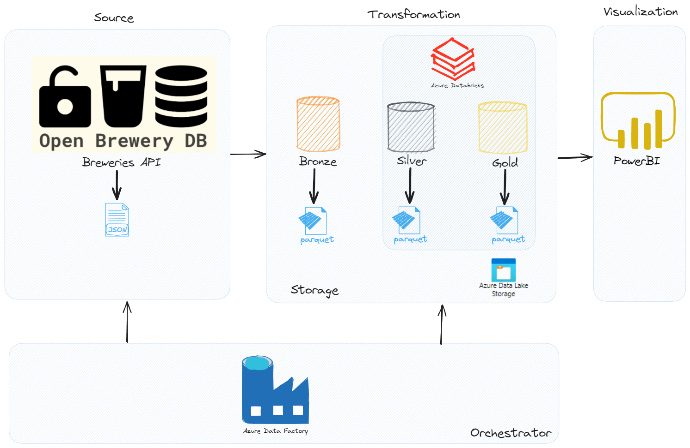

# Case-Open-Brewery-DB

Data engineering project for the Breweries Case, implementing a pipeline with Azure Data Factory and Azure Databricks. Ingests data from Open Brewery DB API, processes it through Bronze, Silver (Parquet), and Gold layers in a Medallion architecture, culminating in an aggregated analytical layer.

# BEES Data Engineering - Breweries Case Solution

[](https://opensource.org/licenses/MIT) This repository contains the solution for the BEES Data Engineering - Breweries Case. The project involves building an end-to-end data pipeline to ingest data from the Open Brewery DB API, process it using a Medallion architecture, and create an aggregated analytical layer.

## Table of Contents

1.  [Project Objective](#project-objective)
2.  [Architecture Overview](#architecture-overview)
3.  [Tech Stack](#tech-stack)
4.  [Features Implemented](#features-implemented)
5.  [Directory Structure](#directory-structure)
6.  [Setup and Installation](#setup-and-installation)
7.  [Usage - How to Run](#usage---how-to-run)
8.  [Data Pipeline Details](#data-pipeline-details)
    - [Orchestration](#orchestration)
    - [Bronze Layer](#bronze-layer)
    - [Silver Layer](#silver-layer)
    - [Gold Layer](#gold-layer)
9.  [Testing](#testing)
10. [Monitoring and Alerting](#monitoring-and-alerting)
11. [Design Choices and Trade-offs](#design-choices-and-trade-offs)
12. [Future Improvements](#future-improvements)
13. [Contact](#contact)

## Project Objective

The primary goal of this project is to design and implement a robust data pipeline that:

- Consumes data from the Open Brewery DB API.
- Transforms and persists this data into a data lake following the Medallion architecture (Bronze, Silver, and Gold layers).
- Provides an aggregated analytical layer for insights.
- Demonstrates best practices in data engineering, including orchestration, error handling, testing, and documentation.

## Architecture Overview

The solution implements the following architecture:



**Flow:**

1.  **Data Ingestion:** Brewery data is fetched from the [Open Brewery DB API](https://api.openbrewerydb.org/breweries). [cite: 3]
2.  **Orchestration:** Azure Data Factory is used to schedule and manage the data pipeline, handling retries and error logging. [cite: 4]
3.  **Storage:** Azure Data Lake Storage Gen2 is used as the data lake.
4.  **Transformation:** Azure Databricks (using PySpark/Python) processes the data through the Medallion layers:
    - **Bronze:** Raw API data stored (e.g., in Parquet format). [cite: 9]
    - **Silver:** Cleansed, transformed, and partitioned data (e.g., in Parquet/Delta format, partitioned by location). [cite: 10]
    - **Gold:** Aggregated data for analytics (e.g., breweries per type and location). [cite: 11]
5.  **Visualization (Optional):** Power BI can be connected to the Gold layer for creating dashboards and reports.

## Tech Stack

- **Cloud Provider:** Microsoft Azure
- **Orchestration:** Azure Data Factory
- **Data Processing:** Azure Databricks (Apache Spark, PySpark, Python)
- **Data Lake Storage:** Azure Data Lake Storage Gen2
- **Data Format:** Parquet (and/or Delta Lake for Silver/Gold)
- **API Interaction:** Python (e.g., `requests` library)
- **Testing:** [e.g., Pytest, Unittest] [cite: 6]
- **Containerization (Optional):** Docker [cite: 7]
- **Version Control:** Git & GitHub

## Features Implemented

- **API Data Consumption:** Successfully fetches data from the specified Open Brewery DB endpoint. [cite: 3]
- **Data Pipeline Orchestration:**
  - Scheduled pipeline runs. [cite: 4]
  - Retry mechanisms for transient failures. [cite: 4]
  - Error handling and logging. [cite: 4]
- **Medallion Data Lake Architecture:** [cite: 8]
  - **Bronze Layer:** Stores raw data from the API. [cite: 9]
  - **Silver Layer:** Implements data cleaning, transformation, columnar storage (Parquet/Delta), and partitioning by brewery location. [cite: 10]
  - **Gold Layer:** Creates an aggregated view showing the quantity of breweries per type and location. [cite: 11]
- **Code Testing:** Includes test cases for data transformation logic. [cite: 6]
- **Documentation:** Comprehensive README, inline code comments, and design choice explanations. [cite: 15]
- **(Optional) Containerization:** [Describe if Docker was used for any part of the solution]. [cite: 7]

## Directory Structure

Okay, let's craft a comprehensive README for your GitHub project. This template will include sections based on common best practices and the specific requirements mentioned in your "Data Engineering Case Ambev.pdf".

You'll need to fill in some of the specific details as you develop the project, but this will give you a solid structure.

Markdown

# BEES Data Engineering - Breweries Case Solution

[](https://opensource.org/licenses/MIT) This repository contains the solution for the BEES Data Engineering - Breweries Case. The project involves building an end-to-end data pipeline to ingest data from the Open Brewery DB API, process it using a Medallion architecture, and create an aggregated analytical layer.

## Table of Contents

1.  [Project Objective](#project-objective)
2.  [Architecture Overview](#architecture-overview)
3.  [Tech Stack](#tech-stack)
4.  [Features Implemented](#features-implemented)
5.  [Directory Structure](#directory-structure)
6.  [Setup and Installation](#setup-and-installation)
7.  [Usage - How to Run](#usage---how-to-run)
8.  [Data Pipeline Details](#data-pipeline-details)
    - [Orchestration](#orchestration)
    - [Bronze Layer](#bronze-layer)
    - [Silver Layer](#silver-layer)
    - [Gold Layer](#gold-layer)
9.  [Testing](#testing)
10. [Monitoring and Alerting](#monitoring-and-alerting)
11. [Design Choices and Trade-offs](#design-choices-and-trade-offs) [cite: 15]
12. [Future Improvements](#future-improvements)
13. [Contact](#contact)

## Project Objective

The primary goal of this project is to design and implement a robust data pipeline that:

- Consumes data from the Open Brewery DB API. [cite: 2]
- Transforms and persists this data into a data lake following the Medallion architecture (Bronze, Silver, and Gold layers). [cite: 1]
- Provides an aggregated analytical layer for insights. [cite: 1]
- Demonstrates best practices in data engineering, including orchestration, error handling, testing, and documentation. [cite: 4, 6, 15]

## Architecture Overview

The solution implements the following architecture:

_(You can embed the `Arquitetura Case Ambev.jpg` image here)_


**Flow:**

1.  **Data Ingestion:** Brewery data is fetched from the [Open Brewery DB API](https://api.openbrewerydb.org/breweries). [cite: 3]
2.  **Orchestration:** Azure Data Factory is used to schedule and manage the data pipeline, handling retries and error logging. [cite: 4]
3.  **Storage:** Azure Data Lake Storage Gen2 is used as the data lake.
4.  **Transformation:** Azure Databricks (using PySpark/Python) processes the data through the Medallion layers:
    - **Bronze:** Raw API data stored (e.g., in Parquet format). [cite: 9]
    - **Silver:** Cleansed, transformed, and partitioned data (e.g., in Parquet/Delta format, partitioned by location). [cite: 10]
    - **Gold:** Aggregated data for analytics (e.g., breweries per type and location). [cite: 11]
5.  **Visualization (Optional):** Power BI can be connected to the Gold layer for creating dashboards and reports.

## Tech Stack

- **Cloud Provider:** Microsoft Azure
- **Orchestration:** Azure Data Factory
- **Data Processing:** Azure Databricks (Apache Spark, PySpark, Python)
- **Data Lake Storage:** Azure Data Lake Storage Gen2
- **Data Format:** Parquet (and/or Delta Lake for Silver/Gold)
- **API Interaction:** Python (e.g., `requests` library)
- **Testing:** [e.g., Pytest, Unittest] [cite: 6]
- **Containerization (Optional):** Docker [cite: 7]
- **Version Control:** Git & GitHub

## Features Implemented

- **API Data Consumption:** Successfully fetches data from the specified Open Brewery DB endpoint. [cite: 3]
- **Data Pipeline Orchestration:**
  - Scheduled pipeline runs. [cite: 4]
  - Retry mechanisms for transient failures. [cite: 4]
  - Error handling and logging. [cite: 4]
- **Medallion Data Lake Architecture:** [cite: 8]
  - **Bronze Layer:** Stores raw data from the API. [cite: 9]
  - **Silver Layer:** Implements data cleaning, transformation, columnar storage (Parquet/Delta), and partitioning by brewery location. [cite: 10]
  - **Gold Layer:** Creates an aggregated view showing the quantity of breweries per type and location. [cite: 11]
- **Code Testing:** Includes test cases for data transformation logic. [cite: 6]
- **Documentation:** Comprehensive README, inline code comments, and design choice explanations. [cite: 15]
- **(Optional) Containerization:** [Describe if Docker was used for any part of the solution]. [cite: 7]

## Directory Structure

```text
.
├── .github/                # GitHub Actions, issue templates, etc. (Optional)
├── data/                   # Sample data, local storage for Bronze/Silver/Gold (if running locally)
│   ├── bronze/
│   ├── silver/
│   └── gold/
├── notebooks/              # Databricks notebooks (if used extensively)
├── src/                    # Source code for the pipeline (Python scripts, PySpark jobs)
│   ├── ingestion/
│   ├── transformation/
│   └── tests/
├── adf/                    # Azure Data Factory JSON definitions (if exporting)
├── docker/                 # Dockerfile and related files (if using containerization)
├── docs/                   # Additional documentation, diagrams
├── .gitignore
├── LICENSE
├── README.md
└── requirements.txt        # Python dependencies
```

## Setup and Installation

Provide clear, step-by-step instructions on how to set up and run your application. [cite: 15]

1.  **Prerequisites:**

    - Azure Subscription
    - Azure CLI / PowerShell with Azure modules
    - Python 3.x
    - Git
    - (If applicable) Docker Desktop
    - Access to Open Brewery DB API (no key required for public endpoints)

2.  **Clone the Repository:**

    ```bash
    git clone [https://github.com/YOUR_USERNAME/YOUR_REPOSITORY_NAME.git](https://github.com/YOUR_USERNAME/YOUR_REPOSITORY_NAME.git)
    cd YOUR_REPOSITORY_NAME
    ```

3.  **Set up Python Environment:**

    ```bash
    python -m venv venv
    source venv/bin/activate  # On Windows: venv\Scripts\activate
    pip install -r requirements.txt
    ```

4.  **Azure Services Setup:** [cite: 16]

    - **Azure Data Lake Storage Gen2:**
      - Create a Storage Account.
      - Create a container (e.g., `brewery-data`).
      - Set up necessary permissions/access keys.
    - **Azure Databricks:**
      - Create a Databricks workspace.
      - Configure a cluster.
      - Set up secrets for accessing ADLS Gen2 (e.g., using Azure Key Vault).
    - **Azure Data Factory:**
      _ Create a Data Factory instance.
      _ Configure Linked Services for Databricks and ADLS Gen2.
      _ Deploy pipelines.
      _(Note: As per instructions, specific cloud service setup details that might expose sensitive info should not be in the public repo, but you can describe the general resources needed.)\* [cite: 17]

5.  **Configuration:**
    - Explain where to configure API endpoints, storage account names, Databricks workspace URLs, etc. (e.g., environment variables, configuration files).

## Usage - How to Run

Instructions on how to execute your pipeline. [cite: 15]

- **Through Azure Data Factory:**

  1.  Navigate to your Azure Data Factory instance in the Azure portal.
  2.  Go to "Author & Monitor".
  3.  Find your main pipeline (e.g., `BreweryDataPipeline`).
  4.  Trigger the pipeline manually or ensure the schedule is active.

- **(Optional) Running parts locally/via Databricks:**
  - Explain how to run individual Databricks notebooks or Python scripts if applicable for development or testing.

## Data Pipeline Details

### Orchestration [cite: 4]

- **Tool:** Azure Data Factory
- **Scheduling:** [Describe your scheduling strategy, e.g., daily at 2 AM UTC]
- **Retries:** [Describe retry configuration, e.g., 3 retries with 5-minute intervals]
- **Error Handling:** [Describe how errors are caught, logged, and what happens on failure, e.g., notifications, dead-lettering]

### Bronze Layer [cite: 9]

- **Source:** Raw JSON data from Open Brewery DB API.
- **Format:** Persisted in [Native JSON / Parquet / chosen format].
- **Transformations:** Minimal; primarily focused on raw ingestion.
- **Location:** `adl://<your-adls-account>/brewery-data/bronze/`

### Silver Layer [cite: 10]

- **Source:** Bronze layer data.
- **Format:** Transformed to [Parquet / Delta Lake].
- **Transformations:**
  - Data type casting and schema enforcement.
  - Handling of null or missing values.
  - [List any other specific transformations you perform, e.g., renaming columns, deriving new fields]. [cite: 11]
  - Filtering out unnecessary data.
- **Partitioning:** Data is partitioned by `brewery_location` (e.g., `state` or `country` field from the API). [cite: 10]
- **Location:** `adl://<your-adls-account>/brewery-data/silver/`

### Gold Layer [cite: 11]

- **Source:** Silver layer data.
- **Format:** [Parquet / Delta Lake].
- **Aggregations:**
  - Calculates the quantity of breweries per `brewery_type` and `location` (e.g., state/country).
- **Purpose:** Serves as the analytical layer for business intelligence and reporting.
- **Location:** `adl://<your-adls-account>/brewery-data/gold/`

## Testing [cite: 6]

- Describe your testing strategy.
- **Unit Tests:** For individual transformation functions (e.g., using Pytest or Python's `unittest`).
  - Example: Testing data type conversions, null handling logic, specific business rule implementations.
- **Integration Tests (Conceptual):** How different components of the pipeline would be tested together (e.g., testing a small batch of data through the Bronze-Silver-Gold flow).
- **How to run tests:**
  ```bash
  # Example if using pytest
  pytest src/tests/
  ```

```

## Monitoring and Alerting [cite: 12]

Describe your approach for monitoring and alerting: [cite: 13]

- **Pipeline Failures:**
  - **Monitoring:** Azure Data Factory run history, Azure Monitor.
  - **Alerting:** Configure alerts in Azure Monitor for pipeline failure statuses in ADF. Notifications via email, SMS, or Logic Apps.
- **Data Quality Issues:**
  - **Monitoring:** Implement data quality checks within Databricks notebooks (e.g., using Deequ, Great Expectations, or custom PySpark checks).
    - Examples: Null counts in critical columns, schema drift detection, value range validation.
    - Log DQ metrics to a dedicated table or log analytics.
  - **Alerting:** Alerts based on DQ metric thresholds. If DQ checks fail, the pipeline could either halt or flag data for review.
- **Performance Monitoring:**
  - **Monitoring:** Azure Databricks Spark UI, Azure Monitor for Databricks cluster performance (CPU, memory, shuffle). ADF pipeline duration.
  - **Alerting:** Alerts for long-running jobs or resource bottlenecks.
- **API Availability/Errors:**
  - **Monitoring:** Log API response codes during ingestion.
  - **Alerting:** Alerts for consistent API errors (e.g., 4xx, 5xx responses).

## Design Choices and Trade-offs [cite: 15]

- **Orchestration Tool:** Chose Azure Data Factory for its native integration with Azure services (Databricks, ADLS), visual interface for pipeline design, and robust scheduling/monitoring features.
  - _Trade-off:_ Might be less flexible for complex Python-based orchestration logic compared to Airflow, but simpler for Azure-centric workloads.
- **Data Processing:** Chose Azure Databricks with PySpark due to its scalability for large datasets and Spark's powerful distributed processing capabilities. Python is used for its ease of use in API interaction and scripting. [cite: 6]
- **Storage Format:**
  - Bronze: [Explain choice, e.g., Parquet for schema evolution and compression benefits even for "raw" data, or keeping as JSON if truly raw is desired].
  - Silver/Gold: Chose Parquet (or Delta Lake) for its columnar storage benefits (compression, query performance). Delta Lake would be chosen if ACID transactions, time travel, and schema enforcement are critical.
    - _Trade-off:_ Delta Lake adds a slight overhead but provides significant reliability features. Parquet is simpler if those features are not immediately needed.
- **Partitioning Strategy (Silver Layer):** Partitioning by `location` (e.g., `state`) was chosen to optimize queries that filter by location, which is a common use case for brewery data. [cite: 10]
  - _Trade-off:_ Might lead to small file problems if some locations have very few breweries. Considered [alternative partitioning strategy] but decided against it because [reason].
- [Add any other significant design choices and their justifications/trade-offs]

## Future Improvements

- Implement Delta Lake for Silver and Gold layers for enhanced data reliability and ACID transactions.
- Expand data quality checks using a framework like Great Expectations.
- Integrate Azure Key Vault for more secure management of secrets and connection strings.
- Develop more comprehensive integration tests.
- Add CI/CD pipelines using GitHub Actions for automated testing and deployment.
- Containerize Python scripts for ingestion/utility tasks using Docker for consistency. [cite: 7]

## Contact

Denner Augusto de Barros Fabiano - denner.augustobarros@gmail.com

- [Linkedin](https://www.linkedin.com/in/denneraugusto/)
- [Whatsapp](wa.me/5511960999936)
```
